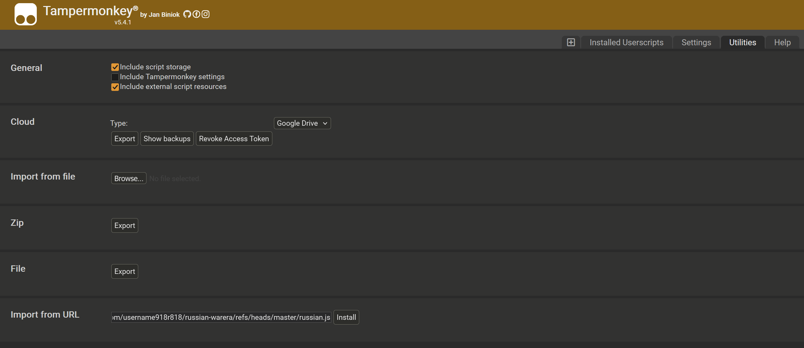
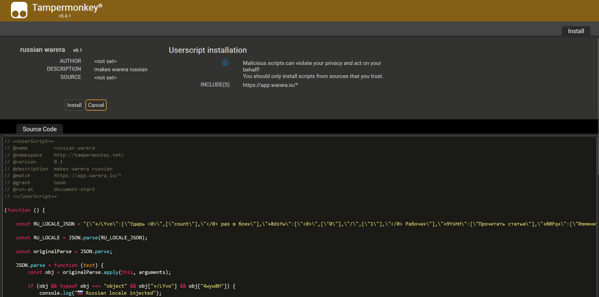
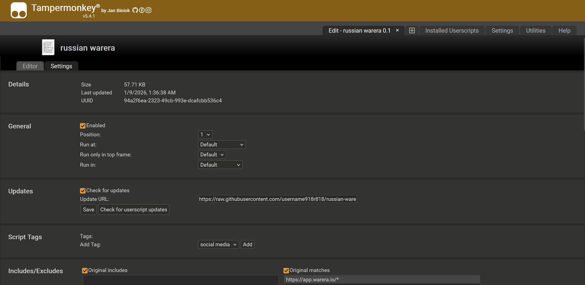

# Russian War Era

Русская локализация для игры War Era.

## Использование

1. Установить [Tampermonkey](https://www.tampermonkey.net/) в браузер

2. Открыть Tampermonkey → **Utilities** → **Import from URL**

3. Вставить URL и нажать **Install**:

   ```https://raw.githubusercontent.com/username918r818/russian-warera/refs/heads/master/russian.js```

   
   

4. *(Опционально)* Включить автообновления:
   - Открыть **Installed Userscripts**
   - Найти **russian warera** → нажать иконку редактирования
   - Вкладка **Settings** → **Updates** → включить **Check for updates**

   

## Файлы

- `ru.json` — русский перевод
- `en.json` — исходный английский
- `russian.js` — Tampermonkey userscript для инжекта локализации
- `script.py` — генератор и валидатор `russian.js`
- `check_structure.py` — проверка структурного соответствия `ru.json` `en.json`
- `format_json.py` — форматтер JSON файлов

## Команды

```bash
# Генерация russian.js из ru.json
python script.py

# Проверка совпадения russian.js без перезаписи
python script.py --check

# Структурная проверка ru.json vs en.json
python check_structure.py

# Форматирование JSON
python format_json.py

# Проверка форматирования без изменений
python format_json.py --check
```
